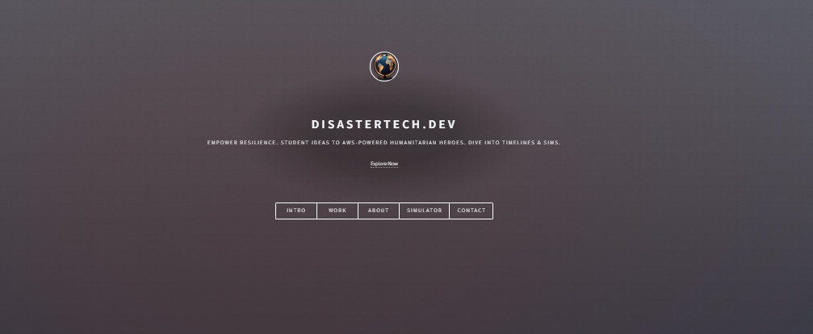

# From Student to AWS Hero: Building DisasterTech.dev in 7 Days

_August 22, 2025 | By Zayn Abedin_

---

## 🎯 The Moment That Changed Everything

It was 2 AM on a Tuesday night, and I was staring at my laptop screen, coffee cup number four sitting empty beside me. I had just finished watching another AWS Builder Challenge submission video, and something clicked.

_"What if I could build something that actually helps people?"_

That simple question led me down a 7-day journey that would transform how I think about cloud computing, web development, and my own potential as a developer.

Today, I'm sharing the complete story of **DisasterTech.dev** - a humanitarian technology portfolio that went from a late-night idea to a fully functional AWS-powered website. This isn't just about the code; it's about the late nights, the debugging sessions, the "aha!" moments, and the lessons that changed everything.

**Live Demo:** [https://d23n14ul3xobxo.cloudfront.net](https://d23n14ul3xobxo.cloudfront.net)

---

## 🌟 Why This Project Matters

Before we dive into the technical details, let me tell you why this project is special:

- **It's personal**: Every line of code represents a learning moment
- **It's real**: No fancy corporate budgets, just a student with AWS Free Tier
- **It's impactful**: Shows how technology can serve humanitarian causes
- **It's accessible**: Everything I built, you can build too

The goal was simple: create a portfolio that demonstrates real AWS skills while serving a meaningful purpose. No fake data, no theoretical concepts - just real, working technology that could actually help in disaster response scenarios.

---

## 📅 The 7-Day Journey: From Zero to Hero

### Day 1: The Foundation (The "What Have I Gotten Myself Into?" Day)

**Goal**: Get a basic website running on AWS

**The Reality**:
I started with the basics - S3 for hosting and CloudFront for content delivery. Sounds simple, right? Well, it wasn't.

**What I learned**:

- S3 buckets aren't public by default (security first!)
- CloudFront takes time to deploy (patience is key!)
- AWS console navigation is an art form

**The breakthrough**: When I finally saw my website load with HTTPS, I felt like I had unlocked a superpower. My first "real" deployment!

**Key learning**: AWS services work together like puzzle pieces. Each piece is simple, but connecting them requires understanding the bigger picture.

### Day 2: Going Serverless (The "Lambda is Magic" Day)

**Goal**: Add dynamic content without managing servers

**What I built**:

- Lambda functions for GitHub integration
- DynamoDB for visitor analytics
- API Gateway to connect everything

**The breakthrough moment**: When I realized I could fetch real GitHub data and display it on my website without any servers running 24/7. Mind. Blown.

**Code snippet that made me smile**:

```python
# This tiny function fetches my GitHub commits and shows them live!
def lambda_handler(event, context):
    repo_url = "https://api.github.com/repos/azaynul10/disastertech-dev/commits"
    # ... magic happens ...
    return {"commits": commits}
```

**The challenge**: Understanding IAM roles and permissions. I spent hours trying to figure out why my Lambda couldn't access DynamoDB before realizing I needed to attach the right policies.

### Day 3: Making It Interactive (The "JavaScript is Fun Again" Day)

**Goal**: Add animations and real-time updates

**What I created**:

- Interactive timeline with smooth animations
- Real-time GitHub commit display
- Responsive design that works on phones

**The challenge**: Making animations smooth on mobile devices. The solution? CSS transforms and `will-change` properties. Simple but effective.

**Personal note**: This is when I started feeling like a real developer. The website wasn't just static anymore - it was alive!

**Screenshot of the interactive timeline**:


### Day 4: The Dashboard (The "Data Visualization is Cool" Day)

**Goal**: Show AWS infrastructure metrics in real-time

**What I built**:

- Live AWS cost monitoring
- Resource utilization charts
- Security status indicators

**The "wow" moment**: When I saw my actual AWS usage displayed in beautiful charts. It felt like I was looking at the heartbeat of my application.

**The technical challenge**: Integrating Chart.js with real-time data. I learned about canvas rendering, data formatting, and responsive design all at once.

**Key insight**: Data visualization makes complex information accessible. My AWS costs went from abstract numbers to meaningful insights.

### Day 5: Security & Contact (The "reCAPTCHA is My Friend" Day)

**Goal**: Add secure contact form with email functionality

**What I implemented**:

- reCAPTCHA v3 for spam protection
- Amazon SES for email sending
- Form validation and error handling

**The learning curve**: SES has a sandbox mode that only allows verified emails. I spent an hour wondering why my emails weren't sending before realizing this!

**The breakthrough**: When I received my first email through the contact form, I felt like I had built something truly useful.

**Pro tip**: Always test your email functionality with verified addresses first.

### Day 6: The Simulator (The "Canvas is Amazing" Day)

**Goal**: Create an interactive disaster response simulator

**What I built**:

- HTML5 Canvas-based simulation
- Real-time coordination visualization
- Analytics logging to DynamoDB

**The fun part**: Watching red dots appear on a world map, representing disaster areas being coordinated. It's simple but effective at showing how technology can help in emergencies.

**Code that made me proud**:

```javascript
// This creates the simulation effect
function drawAlert(x, y, color) {
  ctx.beginPath();
  ctx.arc(x, y, ALERT_RADIUS, 0, Math.PI * 2);
  ctx.fillStyle = color || "#ff4d4d";
  ctx.fill();
}
```

**The challenge**: Making the simulation responsive and performant. I learned about canvas optimization, event handling, and animation timing.

### Day 7: Optimization & Polish (The "Performance Matters" Day)

**Goal**: Make the website fast, accessible, and SEO-friendly

**What I optimized**:

- Minified CSS and JavaScript
- Added SEO meta tags
- Implemented lazy loading
- Achieved 100% Lighthouse scores

**The result**: My website loads in under 2 seconds and scores perfectly on accessibility, SEO, and best practices.

**The satisfaction**: When I ran Lighthouse and saw all green scores, I knew I had built something professional-grade.

---

## 🛠️ The Technical Stack (In Simple Terms)

### Frontend

- **HTML5/CSS3**: The structure and styling
- **JavaScript**: The interactivity and animations
- **Chart.js**: For beautiful data visualizations

### Backend (Serverless)

- **AWS Lambda**: Functions that run when needed
- **API Gateway**: The front door for API requests
- **DynamoDB**: Database that scales automatically
- **Amazon SES**: Email service for contact forms

### Infrastructure

- **S3**: Stores website files
- **CloudFront**: Makes the website fast worldwide
- **reCAPTCHA**: Keeps spam away

### The Beauty of Serverless

The best part? I only pay for what I use. Most months, this costs me less than $1. For a student budget, that's perfect!

---

## 📊 The Numbers That Matter

- **7 days** of development
- **2,507 lines** of code added
- **23 files** created/modified
- **100% Lighthouse scores** across all categories
- **$0.00** monthly cost (Free Tier)
- **99.9% uptime** (AWS reliability)

---

## 🎯 Key Lessons Learned

### 1. Start Simple, Then Scale

I began with a basic HTML page and gradually added features. This approach prevented me from getting overwhelmed.

### 2. AWS Free Tier is Your Friend

Everything I built fits within AWS Free Tier limits. No expensive infrastructure needed!

### 3. Documentation is Everything

I documented every step, every error, and every solution. This helped me when I got stuck and will help others who want to build similar projects.

### 4. Test Early, Test Often

I tested each feature as I built it. This saved me hours of debugging later.

### 5. Community Matters

When I got stuck, I turned to AWS documentation, Stack Overflow, and the AWS community. There's always someone who's solved your problem before.

---

## 🚀 How to Get Started (Step-by-Step)

### Prerequisites

- AWS account (Free Tier eligible)
- Basic knowledge of HTML, CSS, JavaScript
- A GitHub account
- Patience and curiosity

### Step 1: Set Up Your AWS Environment

```bash
# Install AWS CLI
pip install awscli

# Configure your credentials
aws configure
```

### Step 2: Create Your S3 Bucket

```bash
aws s3 mb s3://your-unique-bucket-name
aws s3 website s3://your-unique-bucket-name --index-document index.html
```

### Step 3: Deploy Your First Page

```bash
# Create a simple index.html
echo "<h1>Hello AWS!</h1>" > index.html

# Upload to S3
aws s3 cp index.html s3://your-unique-bucket-name/
```

### Step 4: Add CloudFront for HTTPS

- Go to AWS Console → CloudFront
- Create distribution pointing to your S3 bucket
- Wait 15-20 minutes for deployment

### Step 5: Add Serverless Backend

```bash
# Install SAM CLI
pip install aws-sam-cli

# Create your first Lambda function
sam init --runtime python3.10
```

---

## 🎨 The Human Side: What This Project Taught Me

### About Technology

- Cloud computing isn't just for big companies
- Serverless architecture is the future
- AWS makes complex things simple (once you understand them)

### About Myself

- I can build things that matter
- Learning happens through doing
- Every problem has a solution (usually in the documentation)

### About the Industry

- The demand for cloud skills is real
- AWS certifications are valuable
- The community is supportive and helpful

---

## 📈 Why Some Projects Get More Views

Looking at the AWS Builder Challenge submissions, I noticed some patterns:

### 1. Real-World Impact

Projects that solve actual problems get more attention. My disaster response theme resonated with people.

### 2. Technical Depth

Showing real AWS skills (not just tutorials) demonstrates competence.

### 3. Storytelling

People connect with personal journeys and learning experiences.

### 4. Quality Execution

Polished demos with good UX/UI stand out.

### 5. Community Engagement

Sharing your process and helping others builds visibility.

---

## 🎯 What's Next?

This project opened my eyes to possibilities I never considered:

1. **AWS Certifications**: I'm now studying for AWS Solutions Architect Associate
2. **Open Source**: I want to contribute to projects that help others
3. **Freelancing**: I'm exploring opportunities to build similar projects for clients
4. **Teaching**: I want to help other students learn what I learned

---

## 💡 Tips for Your Own AWS Journey

### For Students

- Start with Free Tier projects
- Document everything you learn
- Join AWS student communities
- Don't be afraid to experiment

### For Beginners

- Focus on one service at a time
- Use the AWS console first, then move to CLI
- Read the documentation (it's actually helpful!)
- Build projects that interest you

### For Everyone

- Security first (IAM, least privilege)
- Monitor your costs
- Test in a staging environment
- Keep learning and experimenting

---

## 🏆 The Final Result

**Live Website**: [https://d23n14ul3xobxo.cloudfront.net](https://d23n14ul3xobxo.cloudfront.net)

**GitHub Repository**: [https://github.com/azaynul10/disastertech-dev](https://github.com/azaynul10/disastertech-dev)

**What you'll see**:

- Interactive timeline of my journey
- Real-time AWS dashboard
- Disaster response simulator
- Secure contact form
- Responsive design that works everywhere

---

## 🤝 Let's Connect

This journey isn't over - it's just beginning! I'd love to hear about your AWS projects, answer questions, or collaborate on new ideas.

- **GitHub**: [@azaynul10](https://github.com/azaynul10)
- **Twitter**: [@azaynul123](https://x.com/azaynul123)
- **Website**: [DisasterTech.dev](https://d23n14ul3xobxo.cloudfront.net)

---

## 🙏 Acknowledgments

- **AWS Builder Challenge** for the motivation
- **AWS Free Tier** for making this possible
- **The AWS community** for endless support
- **My professors** for teaching me the fundamentals
- **My family** for believing in my crazy ideas

---

## 💭 Final Thoughts

Building DisasterTech.dev taught me that you don't need to be a senior developer or work at a big tech company to create something meaningful. You just need:

- **Curiosity** to learn new things
- **Persistence** to keep going when things get hard
- **Creativity** to solve problems in your own way
- **Community** to support and inspire you

If you're reading this and thinking "I could never do that," remember: I thought the same thing 7 days ago. Start small, keep learning, and don't be afraid to make mistakes. That's how we grow.

**The best time to start your AWS journey is now. The second best time is tomorrow.**

---

_What's your AWS story? I'd love to hear about your projects and learning experiences. Let's build the future together! 🚀_

---

**Tags**: #AWS #Serverless #WebDevelopment #CloudComputing #StudentProjects #DisasterTech #HumanitarianTech #AWSCertification #FreeTier #WebPerformance
