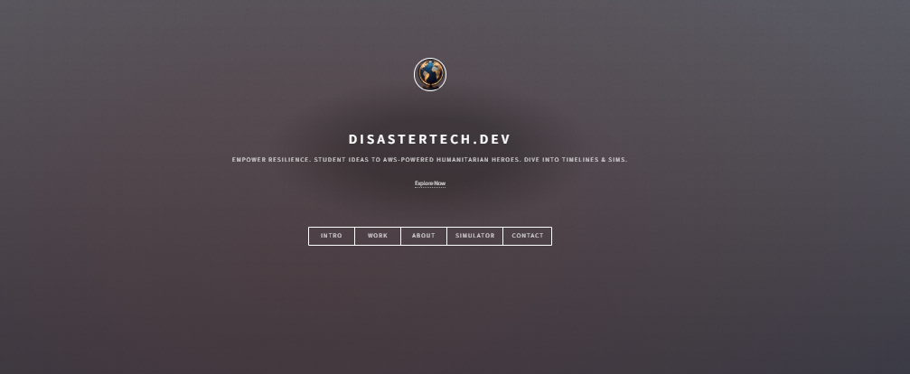

# DisasterTech.dev - Humanitarian Tech Hub with AWS

Live: https://d23n14ul3xobxo.cloudfront.net

## Overview

DisasterTech.dev is a showcase for humanitarian tech innovation, built in 7 days for the AWS Builder Challenge. From foundation to simulator, it demonstrates AWS-powered tools for global resilience—interactive timeline, real-time GitHub updates, visitor analytics, infrastructure dashboard, secure contact form, and disaster response sim. Free Tier, serverless focus.

## Key Features

- **Interactive Timeline**: Animated journey from student to innovator with GitHub integration.
- **Real-Time Dashboard**: AWS metrics for costs/utilization/security.
- **Contact Form**: Secure with reCAPTCHA and SES emails.
- **Disaster Simulator**: JS canvas demo of coordination (logs to DynamoDB).
- **Optimized & Accessible**: 100% Lighthouse in Accessibility/SEO/Best Practices.

## AWS Services Used

- S3 & CloudFront: Static hosting/HTTPS.
- Lambda, API Gateway, DynamoDB: Backend for updates/analytics/contact.
- SES: Email sending.
- CloudWatch: Monitoring (dashboard integration).
- All Free Tier—no costs!

## Setup & Deployment

1. Clone repo: `git clone https://github.com/azaynul10/disastertech-dev`.
2. Configure AWS CLI with IAM admin user (from Day 1).
3. Deploy backend: cd serverless-backend/disastertech-backend > `sam build && sam deploy --guided` (use your params).
4. Sync frontend to S3: cd .. > `aws s3 sync . s3://your-bucket --exclude ".git/*" --exclude "serverless-backend/*"`.
5. Invalidate CloudFront: Console or CLI with /\*.
6. Local test: Open index.html.

## Challenge Learnings

- Day 1: Branded template on S3/CloudFront—learned HTTPS setup.
- Day 2: Serverless dynamic content—SAM for Lambda/DynamoDB.
- Day 3: Animated timeline with JS—integrated GitHub API.
- Day 4: Dashboard for monitoring—Chart.js for visuals.
- Day 5: Contact with SES/reCAPTCHA—sandbox to production.
- Day 6: Canvas sim—educational demo logging to backend.
- Day 7: Optimized with Lighthouse—minified JS/CSS, SEO meta.

Aha! Moment: "Serverless AWS turned ideas into impact—Free Tier made it accessible for all innovators."

## License

Based on HTML5 UP Dimension (CC BY 3.0)—customized for this project.

## Credits

- Template: HTML5 UP
- Icons: Font Awesome
- Charts: Chart.js
- Map: Wikimedia SVG

Live: https://d23n14ul3xobxo.cloudfront.net
Demo Video: https://youtu.be/-fjJp_qWs9g
Thanks for visiting—let's build for good!
